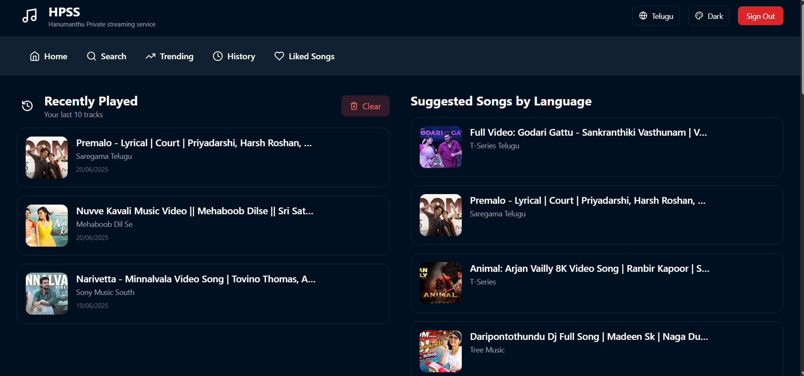
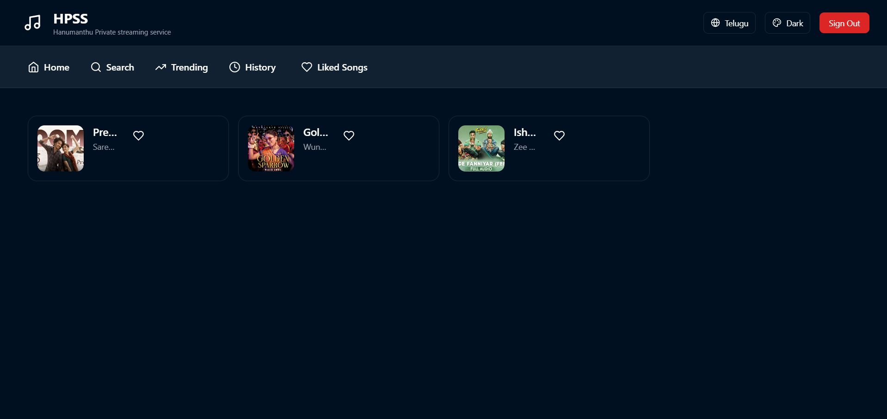
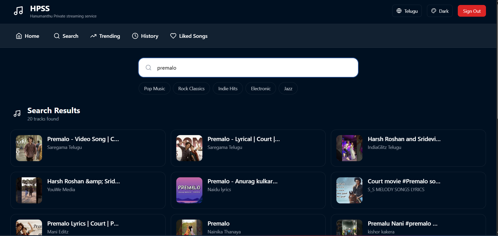

# 🎧 HPSSV1 – Private Music Streaming Platform

**HPSSV1** is a sleek, responsive, and fully functional private music streaming platform built using **React**, **Tailwind CSS**, **YouTube API**, and **Firebase**. It offers persistent user-based liked songs, real-time search, dynamic theming, and playback history — all packed into a stunning neon-glassmorphic UI.

## 🚀 Live Demo
🔗 [Visit Site](https://hpssv1.netlify.app)

---

## 🔥 Features

- 🔐 **Google Sign-In** with Firebase Authentication
- ❤️ **Liked Songs** persist across sessions via Firestore
- 🔍 **Search & Language-Based Music Suggestions**
- 🎨 **Neon/Dark Theme** toggle with glassmorphism UI
- 📱 **Responsive Design** (PC-first; mobile optimization WIP)
- 🕘 **Playback History & Recent Songs** tracking
- ⚡ **Deployed with Netlify** and CI/CD from GitHub

---

## 🛠️ Tech Stack

- **Frontend:** React, Tailwind CSS, React Router
- **Backend/API:** YouTube Data API v3
- **Auth & DB:** Firebase Auth, Cloud Firestore
- **Deployment:** Netlify

---

## 📂 Folder Structure
src/
├── components/ # Reusable UI components
├── pages/ # Main app screens (Home, Search, etc.)
├── context/ # Global app context (auth, theme, etc.)
├── services/ # YouTube & Firestore API functions
├── assets/ # Icons, images
└── App.jsx # Entry point

yaml
Copy
Edit

---

## 🧠 Future Improvements
- 📱 Mobile-first redesign
- 🎼 Playlist creation & shuffle
- 📤 Export liked songs
- 🎧 Real-time playback sync across devices

---

## 📸 Screenshots
| Home Page | Liked Songs | Search Results |
|----------|-------------|----------------|
|  |  |  |

---

## 🙌 Credits

- Powered by **YouTube Data API**
- UI inspired by **Glassmorphism** & modern music UIs
- Auth & DB via **Firebase**

---

## 📜 License
This project is for educational and personal use only. Do not use commercially due to YouTube API ToS.
